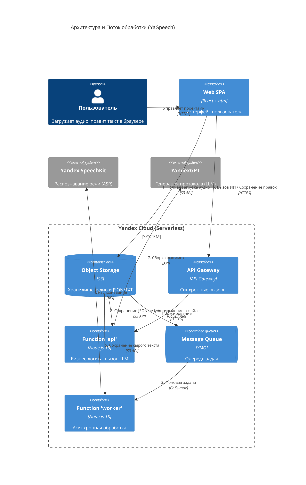

# YaSpeech — протоколы встреч без ручной расшифровки

[](https://github.com/Gumbatali/YaSpeech/actions/workflows/ci.yml)

YaSpeech превращает аудиозапись совещания в готовый протокол: кто что сказал,
о чём договорились, какие задачи и сроки. Загрузили запись — за минуту получили
дословную расшифровку, по кнопке улучшили её с помощью ИИ, собрали протокол.
Сделано для строительной компании СТРОЙТЕХЭКСПЕРТ, работает в Яндекс Облаке.

**Прод:** https://d5dk1on1i3j14e4gemus.z2ka767n.apigw.yandexcloud.net

> 🧭 **Куда смотреть:** [что это и зачем](./docs/КАК-ЭТО-РАБОТАЕТ.md) ·
> [как участвовать в разработке](./CONTRIBUTING.md) ·
> [Project Handbook](./docs/project-handbook/README.md) (вся документация)

---

## Оглавление

- [Что умеет](#что-умеет)
- [Скриншоты интерфейса](#скриншоты-интерфейса)
- [Как использовать](#как-использовать)
- [Архитектура](#архитектура)
- [Запуск локально](#запуск-локально)
- [Деплой в Яндекс Облако](#деплой-в-яндекс-облако)
- [Документация](#документация)
- [Обратная связь](#обратная-связь)

---

## Скриншоты интерфейса

> 📸 **Здесь будут скриншоты**
> _(Добавьте сюда 1-2 скриншота или GIF, демонстрирующих плеер, список встреч или редактирование протокола, чтобы сразу показать продукт вживую)_

---

## Что умеет

| Возможность | Что это даёт |
|-------------|--------------|
| Загрузка аудио | MP3, M4A, WAV, OGG, FLAC, голосовые из мессенджеров |
| Автоматическая расшифровка | Текст встречи без ручного труда |
| Разделение по спикерам | Кто что сказал, у каждого свой цвет |
| Идентификация имён и ролей | Прораб, заказчик — или описание роли, если имя неизвестно |
| Таймкоды | Каждая реплика с временем от начала записи |
| Две версии текста | Дословно (ASR) и с исправлениями (LLM) |
| Редактирование расшифровки | Поправить любой фрагмент вручную |
| Готовый протокол | Обзор, участники, решения, задачи с ответственными и сроками |
| Редактирование итогов | Любой пункт протокола изменить прямо в браузере |
| Вход и личные кабинеты | Логин/пароль, у каждого свои проекты |
| Администрирование | Управление пользователями, банами, квотами |

---

## Как использовать

1. Войти по логину и паролю
2. Создать проект (например, конкретный строительный объект)
3. Добавить команду проекта (необязательно — помогает точнее определять спикеров)
4. Загрузить запись встречи
5. Подождать обработку — статус меняется автоматически
6. Проверить черновик — поправить имена и название встречи
7. Получить протокол — скопировать, скачать или отредактировать

---

## Архитектура (C4 Container Model)

Ключевой принцип архитектуры: **ноль автоматических LLM-вызовов**. После распознавания речи (ASR) черновик создается мгновенно и бесплатно. Дорогие LLM-операции (улучшение текста, сборка протокола) запускаются строго по кнопке пользователя.



### Технический стек

- **Runtime:** Node.js 18 на Yandex Cloud Functions (serverless)
- **Хранилище:** Yandex Object Storage (S3-совместимое)
- **Очередь:** Yandex Message Queue
- **Шлюз:** Yandex API Gateway
- **ASR:** Yandex SpeechKit (опционально Groq Whisper)
- **LLM:** YandexGPT (`yandexgpt-lite`) — по кнопке: улучшение расшифровки + сборка протокола
- **Auth:** HMAC-SHA256 сессии + scrypt — только встроенные модули Node, **ноль npm в продакшне**

### Что и где искать (Структура папок)

Проект построен по принципам монорепозитория, где бизнес-логика жестко отделена от облачной инфраструктуры:

* `packages/core/` — **Сердце системы (Domain & Use Cases).** Здесь лежит чистая бизнес-логика (сущности встреч, проектов). **Важно:** Этот пакет не имеет ни одной зависимости от Yandex Cloud.
* `apps/server/` — **Бэкенд и Инфраструктура.**
  * `src/server/` — HTTP-слой, роутер, адаптеры к Yandex API Gateway.
  * `src/infrastructure/` — Все интеграции: адаптеры к YandexGPT, SpeechKit, S3, YMQ. 
  * `src/application/` — Оркестрация процесса транскрипции (`meeting-pipeline-service.js`).
* `apps/web/` — **Фронтенд (SPA).** Написан на React + htm без сборщиков (Webpack/Vite). Загружается напрямую в браузер.
  * `app/screens/` — Экраны (логин, проект, встреча).
  * `app/api.js` — Клиент для общения с бэкендом.
* `docs/` — **Вся техническая документация.**
* `scripts/` — **Скрипты развертывания и эксплуатации.** (Например, `deploy.sh` для деплоя в облако).

> 📖 **Глубокое погружение:** Детальная структура HTTP-слоя и логика работы фронтенда описана в [Карте кодовой базы](./docs/project-handbook/06-development/codebase-map.md).

---

## Запуск локально

```bash
npm test                    # 54 теста
npm run dev                 # http://127.0.0.1:8787

# С аутентификацией
SESSION_SECRET=dev ADMIN_LOGIN=admin node apps/server/src/dev-server.js
```

Локально работают mock-адаптеры — без реальных облачных вызовов и платных API.
Зависимостей npm нет — `npm install` не нужен.

Подробнее: [локальная разработка](./docs/project-handbook/06-development/local-setup.md) ·
[как участвовать](./CONTRIBUTING.md).

---

## Деплой в Яндекс Облако

**Основной путь — автоматический:** мерж в `main` → GitHub Actions гоняет тесты
и деплоит в прод. Можно и вручную: Actions → **Deploy** → Run workflow.
Настройка секретов и deployer-аккаунта: [CI/CD](./docs/project-handbook/05-delivery-and-operations/ci-cd.md).

**Ручной деплой с машины** (секреты в `scripts/.env.deploy`, в `.gitignore`):

```bash
bash scripts/deploy.sh all       # обе функции + фронтенд + шлюз
bash scripts/deploy.sh api       # api-функция + фронтенд + шлюз
bash scripts/deploy.sh worker    # только worker-функция
bash scripts/deploy.sh frontend  # только фронтенд
bash scripts/deploy.sh gateway   # только API Gateway
```

`deploy.sh` обходит `apps/server/src/` рекурсивно — новые файлы попадают в zip автоматически,
без ручного сопровождения списка файлов. Секреты берёт из `.env.deploy` (локально)
или из переменных окружения (в CI).

Подробности: [облачное развёртывание](./docs/project-handbook/05-delivery-and-operations/cloud-deployment.md)

---

## Документация

**Для всех:**
- **[Как это работает (для нетехнических)](./docs/КАК-ЭТО-РАБОТАЕТ.md)** — без жаргона
- **[Project Handbook](./docs/project-handbook/README.md)** — вся документация, по ролям

**Разработчику:**
- **[Как участвовать (CONTRIBUTING)](./CONTRIBUTING.md)** — старт за 5 минут
- **[Локальная разработка](./docs/project-handbook/06-development/local-setup.md)**
- **[Карта кодовой базы](./docs/project-handbook/06-development/codebase-map.md)**
- **[Обзор архитектуры](./docs/project-handbook/03-solution-architecture/architecture-overview.md)**

**Эксплуатация:**
- **[CI/CD](./docs/project-handbook/05-delivery-and-operations/ci-cd.md)** — автотесты и деплой
- **[Мониторинг и логи](./docs/project-handbook/05-delivery-and-operations/monitoring-and-logging.md)**
- **[Runbook](./docs/project-handbook/05-delivery-and-operations/runbook.md)** — что делать, когда сломалось

---

## Обратная связь

Нашли баг, есть идея или вопрос по проекту?
Пожалуйста, [создайте Issue](https://github.com/Gumbatali/YaSpeech/issues) в этом репозитории. Будем рады любым предложениям по улучшению!
