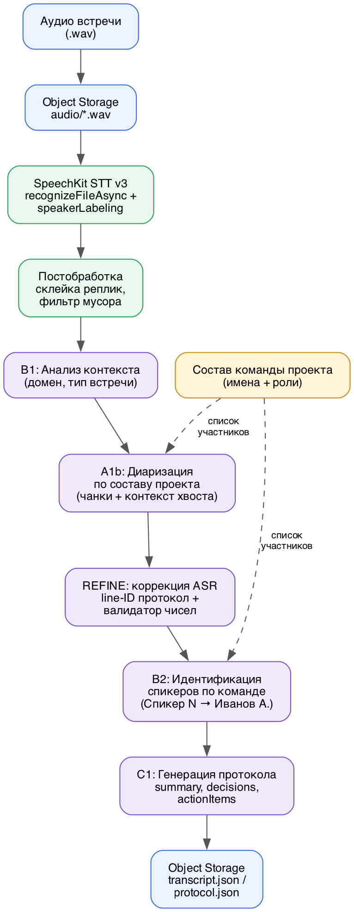

# Навигация: YaSpeech — автопротоколирование деловых встреч на Yandex Cloud
**Учебный пример** сервиса «запись встречи → готовый протокол»: *SpeechKit* (распознавание речи) + *YandexGPT* через OpenAI-совместимое Responses API (диаризация по составу команды, коррекция ошибок ASR, протокол в одном структурированном вызове) + *Object Storage* (промежуточное хранение аудио).



Идея — из внутреннего сервиса **YaSpeech** (компания «Стройтехэксперт», фиксация решений по строительным планёркам), но код здесь самостоятельный и учебный, не портированный прод.

> Прод-сервис (Node.js, Cloud Functions + API Gateway + YMQ) — в ветке [`main`](https://github.com/Gumbatali/YaSpeech-Public/tree/main).

---

## Содержание

### 1. Введение
*   **Назначение**, **описание задачи**, **ожидаемый результат**.
*   **Фишка**: диаризация по составу участников встречи вместо абстрактных «Спикер 1/2».

### 2. Архитектура решения
*   Схема пайплайна: аудио → Object Storage → SpeechKit → один вызов YandexGPT → протокол (JSON).
*   Роли и права сервисных аккаунтов, как их назначить через консоль Yandex Cloud.

### 3. Подготовка окружения
*   Установка зависимостей, чтение ключей из переменных окружения (`.env` или менеджер секретов сервиса).

### 4. Загрузка аудио
*   Object Storage — обязателен, SpeechKit async читает аудио только по ссылке.
*   Автоматическая конвертация в моно 16 кГц через `ffmpeg` (SpeechKit со `speakerLabeling` принимает только монозаписи).

### 5. SpeechKit STT v3
*   Асинхронное распознавание с разметкой по каналам.
*   5.1 Постобработка транскрипта.

### 6. Один вызов YandexGPT
*   Pydantic-схема протокола (`ProtocolOutput`).
*   Промпт: диаризация по составу команды + коррекция ASR + протокол.

### 7. Сборка пайплайна

### 8. Тестирование на реальном аудиофайле

### 9. Результаты и анализ
*   Что мы достигли, как это работает, ключевые параметры, ограничения учебной версии, куда двигаться дальше.

### 10. Полезные ссылки

---

## Быстрый старт

```bash
pip install -r requirements.txt
cp .env.example .env    # заполните реальными значениями
jupyter notebook cookbook_yaspeech.ipynb
```

Ноутбук читает ключи из переменных окружения — не важно, где он выполняется. Если вы открываете его в блокнотном сервисе с собственным менеджером секретов (Google Colab, Kaggle, Deepnote и т.п.), задайте те же переменные там; для Google Colab ячейка 3 подхватывает их автоматически через `google.colab.userdata`, для других сервисов см. комментарий в этой же ячейке.

Что понадобится в Yandex Cloud:

| Переменная | Где взять |
|---|---|
| `FOLDER_ID` | [идентификатор каталога](https://yandex.cloud/ru/docs/resource-manager/operations/folder/get-id) |
| `YC_API_KEY` | [API-ключ сервисного аккаунта](https://yandex.cloud/ru/docs/iam/operations/api-key/create) (роли `ai.speechkit-stt.user`, `ai.languageModels.user`, `storage.uploader` — см. раздел 2 ноутбука) |
| `AWS_ACCESS_KEY_ID` / `AWS_SECRET_ACCESS_KEY` | [статические ключи для Object Storage](https://yandex.cloud/ru/docs/storage/operations/access-keys/create) |

Ноутбук делает реальные платные вызовы (SpeechKit + YandexGPT) и создаёт бакет Object Storage.

---

## Best Practices

1. **Состав команды как контекст, а не угадывание**
   - Передавайте в промпт список участников (имена + роли), если он у вас есть — это резко снижает пространство поиска для модели.
   - Разметка по каналам/паузам от ASR — подсказка о числе говорящих, а не факт; давайте модели право перегруппировать реплики, если разметка выглядит шумной.

2. **Негативные ограничения в промпте**
   - «Пустой список лучше, чем выдумка» — прописывайте явно.
   - Требуйте не менять числа, даты и суммы при коррекции текста — модель может расставить пунктуацию, но не имеет права переписать факт.
   - Отдельно оговаривайте поля, которые обязательны как ярлык (например, заголовок встречи) — иначе то же правило «не выдумывай» модель применит и к ним, и вернёт `null` там, где нужна строка.

3. **Структурированный вывод**
   - Валидируйте ответ модели через Pydantic (или аналог) сразу после парсинга — так видно несоответствие типов, а не только отсутствие JSON.
   - В промпт кладите готовый пример ответа с реальными значениями, а не дамп JSON Schema — модель может спутать метаданные полей (`type`, `description`) с самими данными.
   - Снимайте markdown-обёртку (` ```json ... ``` `) перед парсингом — модель иногда добавляет её, даже если попросили не делать этого.
   - Дублируйте инварианты промпта программной проверкой (`field_validator` и т.п.) — на случай, если модель всё же не послушается.

4. **Обработка ошибок**
   - SpeechKit-операции асинхронны — оборачивайте поллинг таймаутом.
   - Ловите ошибки парсинга JSON — модель может вернуть невалидный ответ на редких входах.
   - Проверяйте формат входного аудио заранее: SpeechKit со `speakerLabeling` принимает только монозаписи — сведение в моно надёжнее делать всегда, а не только «если понадобится».

5. **Масштабирование**
   - Для длинных встреч (десятки тысяч символов) один вызов не поместится в контекст модели — разбивайте на этапы: диаризация+коррекция отдельно от генерации протокола, с чанкингом по репликам.
   - Если асинхронный сервис без общего процесса ожидания — разносите старт распознавания и поллинг операции по отдельным вызовам.

---

## Дополнительные ресурсы

* 🔗 **SpeechKit STT v3**: https://aistudio.yandex.ru/docs/ru/speechkit/stt/api/transcribation-api-v3
* 🔗 **Определение дикторов**: https://aistudio.yandex.ru/docs/ru/speechkit/stt/speaker-labeling
* 🔗 **Поддерживаемые форматы аудио**: https://aistudio.yandex.ru/docs/ru/speechkit/formats
* 🔗 **Доступные модели**: https://aistudio.yandex.ru/docs/ru/ai-studio/concepts/generation/models
* 🔗 **OpenAI-совместимое API**: https://yandex.cloud/en/docs/ai-studio/concepts/openai-compatibility
* 🔗 **Object Storage**: https://yandex.cloud/ru/docs/storage/s3/
* 🔗 **Примеры кода Yandex AI Studio**: https://github.com/yandex-ai-studio/yandex-ai-studio-cookbook

---

## Обратная связь

Нашли ошибку или есть предложение — [создайте Issue](https://github.com/Gumbatali/YaSpeech-Public/issues).

---

**Версия:** 2.1
**Последнее обновление:** Август 2026
**Язык:** Python 3.10+
