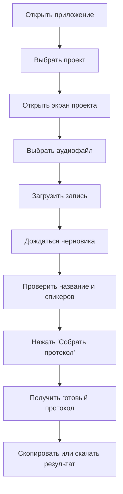

# Пользовательские сценарии

## Основной пользовательский поток

## Сценарий 1. Новая встреча

1. Пользователь открывает список проектов.
2. Выбирает нужный проект.
3. На экране проекта нажимает `Выбрать файл`.
4. Выбирает один аудиофайл встречи.
5. Нажимает `Загрузить запись`.
6. Система показывает статусы обработки.
7. Система показывает черновик встречи.
8. Пользователь подтверждает или правит название и спикеров.
9. Система готовит финальный протокол.

## Сценарий 2. Просмотр прошлой встречи

1. Пользователь открывает проект.
2. В блоке `Последние встречи` выбирает нужную встречу.
3. Открывает готовый протокол.
4. При необходимости скачивает `TXT`.

## Сценарий 3. Обработка завершилась ошибкой

1. Пользователь открывает встречу со статусом ошибки.
2. Видит понятное сообщение о проблеме.
3. Нажимает `Повторить`.
4. Система заново ставит задачу в обработку.

## Сценарий 4. Работа с командой проекта

1. Пользователь открывает экран проекта.
2. Переходит в `Люди проекта`.
3. Добавляет, редактирует или удаляет участников.
4. Возвращается назад к загрузке записи.

## UX-договорённость

Главный экран проекта должен поддерживать только один приоритетный сценарий:

- загрузить запись;
- понять текущий статус;
- перейти к протоколу.

Все вторичные действия должны оставаться вторичными.
