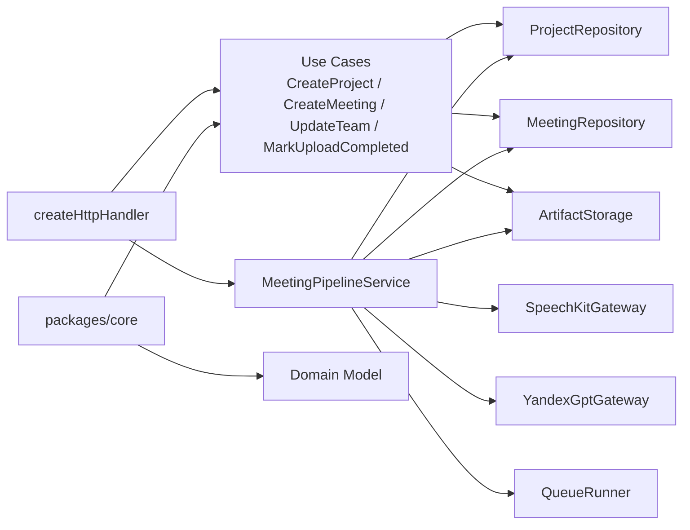

# C4 Component

Схема уровня `Component` для backend-части текущего проекта.

## Компоненты

### `createHttpHandler`

HTTP-слой. Маршрутизирует запросы и вызывает use case или pipeline.

### `packages/core`

Домен и application-логика без привязки к облачным сервисам.

### `MeetingPipelineService`

Оркестратор стадий:

- transcript;
- draft;
- confirm draft;
- final protocol;
- retry / failed.

### Репозитории и шлюзы

- репозитории отвечают за хранение;
- шлюзы отвечают за внешние интеграции;
- очередь отвечает за фоновые задачи.
