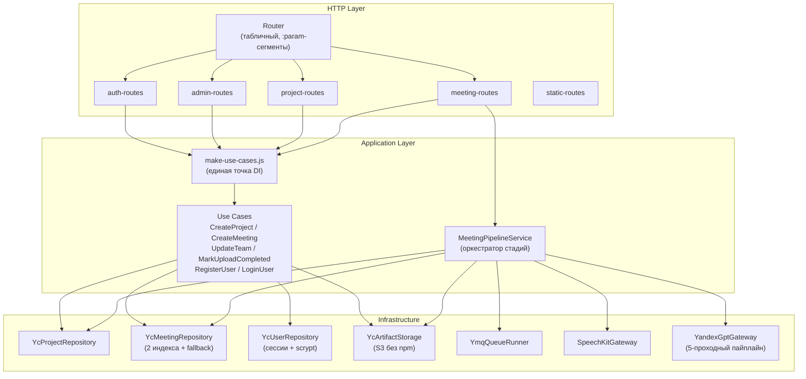

# C4 Component

Схема уровня `Component` для backend-части (после рефакторинга 2026-06-10).

## Компоненты

### `create-http-handler.js` — Composition Root

Точка сборки (~170 строк). Инстанцирует все use cases через `make-use-cases.js`,
регистрирует маршруты, обрабатывает CORS и сессионную middleware.

### `Router`

Табличный роутер (`router.js`). API:
- `Router.add(method, pattern, handler)` — регистрация маршрута с `:param`-сегментами
- `Router.match(method, urlParts)` → `{ handler, params }` или `null`

Заменяет монолитный if-chain на 800 строк.

### Route-модули

| Модуль | Маршруты |
|--------|----------|
| `auth-routes` | `POST /api/auth/register`, `/login`, `/logout`; `GET /api/auth/me` |
| `admin-routes` | `GET /api/admin/users`; `PATCH /api/admin/users/:id/ban`, `/role`, `/quota` |
| `project-routes` | `GET/POST /api/projects`; `GET/PATCH/DELETE /api/projects/:id`; `PATCH /api/projects/:id/team`; `GET /api/projects/:id/meetings` |
| `meeting-routes` | `POST /api/meetings`; `POST /api/meetings/:id/upload-complete`; `POST /api/meetings/:id/confirm-draft`; `GET /api/meetings/:id`; `POST /api/meetings/:id/retry`; `GET /api/meetings/:id/transcript`; `GET/PUT /api/meetings/:id/protocol`; `POST /api/meetings/:id/regenerate`; `DELETE /api/meetings/:id` |
| `static-routes` | `GET /`, `/app/*`, `/lib/*` (dev-сервер и Cloud Function fallback) |

### `make-use-cases.js` — DI

Единственное место, где создаются use cases. Принимает все инфраструктурные
зависимости, возвращает объект с готовыми функциями. Исключает двойную
инициализацию.

### `validate.js` — Граница валидации

Guard-функции: `requireString`, `optionalString`, `requireArray`, `requireObject`,
`optionalIsoDate`, `requireId`. Бросают `UserError` (extends Error, `userFacing: true`),
которая превращается в HTTP 400 в `create-http-handler`.

### `packages/core`

Домен и application-логика без привязки к облаку. Детали — в
[codebase-map.md](../06-development/codebase-map.md).

### `MeetingPipelineService`

Оркестратор стадий обработки встречи:

1. `transcribed` — распознавание речи (SpeechKit / Groq Whisper)
2. `awaiting_draft_confirmation` — LLM-диаризация + коррекция ASR
3. `draft_confirmed` → `generating_protocol` — сборка протокола (YandexGPT)
4. `done` | `failed` — финальный статус

### `YcMeetingRepository`

Два уровня индексов:
- **Глобальный** `meetings/index.json` — быстрый поиск по `meetingId`; хранит `baseKey`
- **Проектный** `projects/{id}/meetings/index.json` — fallback для старых встреч

`getById` пробует глобальный индекс, fallback — сканирование проектных индексов.
