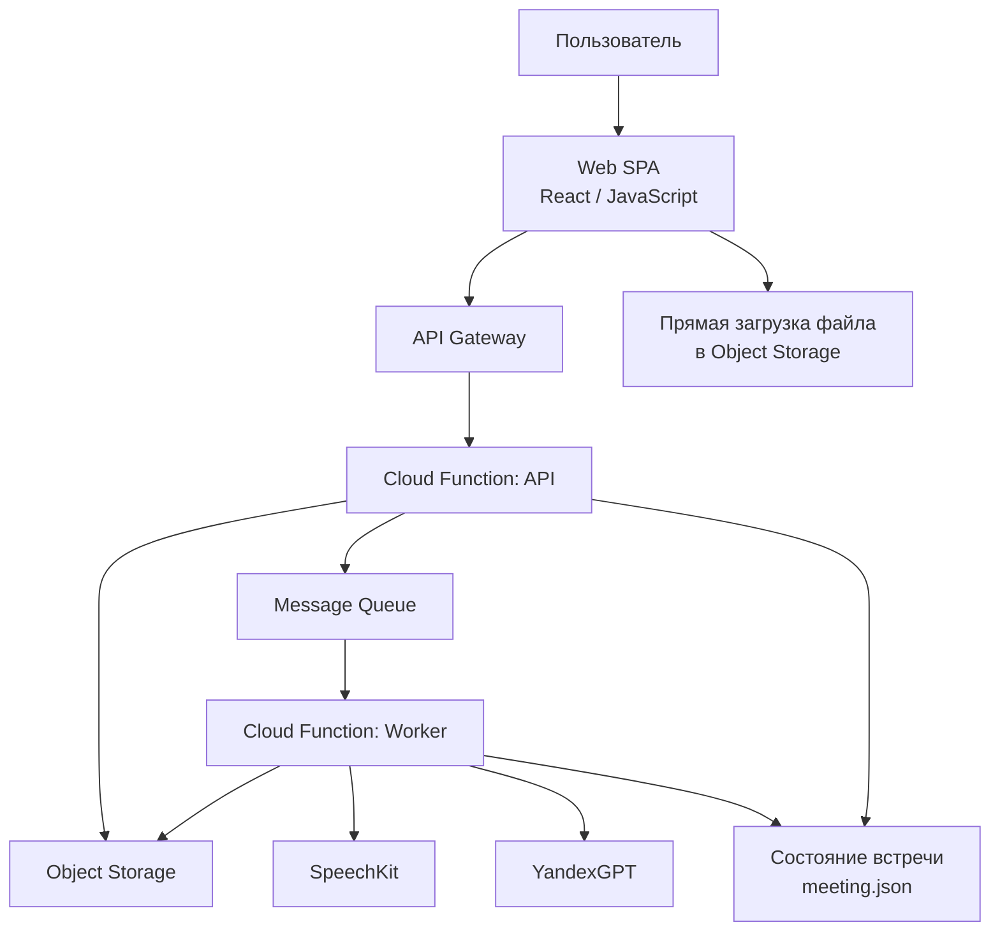

# C4 Container

Схема уровня `Container`: основные исполняемые части решения и их связи.

## Контейнеры

- `Web SPA`
  пользовательский интерфейс.
- `API Gateway`
  публичная точка входа для фронтенда.
- `Cloud Function: API`
  создание проектов, встреч, выдача upload URL, чтение статусов.
- `Object Storage`
  сайт, аудио, транскрипты и протоколы.
- `Message Queue`
  постановка задач на фоновую обработку.
- `Cloud Function: Worker`
  оркестрация транскрипции, draft и протокола.
- `SpeechKit`
  распознавание и подготовка транскрипта.
- `YandexGPT`
  генерация title draft, speaker draft и протокола.
