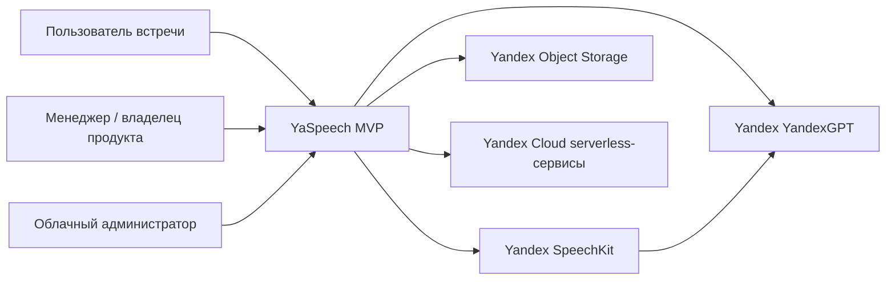

# C4 Context

Схема уровня `System Context`: кто взаимодействует с системой и какие внешние платформы участвуют.

## Пояснение

- `Пользователь встречи` загружает аудио и получает протокол.
- `Менеджер / владелец продукта` определяет правила использования и сценарии.
- `Облачный администратор` настраивает доступы и инфраструктуру.
- `YaSpeech MVP` является продуктовой обёрткой над сервисами Яндекса.
