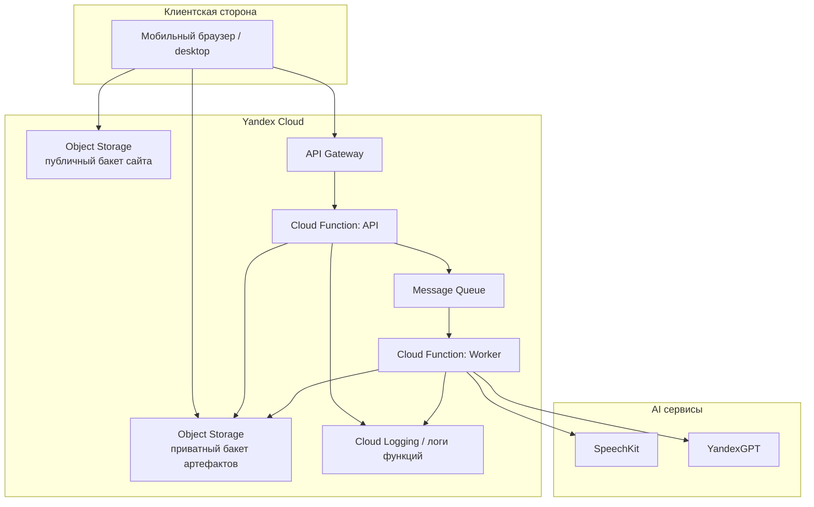

# Deployment и интеграции

## Deployment-контур

## Где живёт код

- код фронтенда публикуется как статический сайт;
- backend-код упаковывается в функции;
- интеграционный конфиг задаётся через переменные окружения функций.

## Где живут данные

- сайт: публичный бакет;
- аудио: приватный бакет;
- JSON-манифесты: приватный бакет;
- транскрипт и протокол: приватный бакет.

## Внешние интеграции

### `SpeechKit`

Используется для распознавания аудиозаписи и получения транскрипта.

### `YandexGPT`

Вызывается **только по действию пользователя** (модель `yandexgpt-lite`):

- по кнопке «✨ Улучшить с помощью ИИ» — диаризация, глоссарий, коррекция ASR,
  определение имён спикеров;
- по кнопке «Собрать протокол» — итоговый протокол (с map-reduce для длинных встреч).

После ASR черновик собирается **без** обращения к YandexGPT.

## Локальный vs облачный контур

### Локально (разработка)

- Node.js HTTP server (`npm run dev`);
- файловое хранилище;
- локальная очередь;
- mock-интеграции (SpeechKit / YandexGPT не вызываются, платных запросов нет).

### В облаке (production)

- API Gateway;
- Cloud Functions (`yaspeech-api`, `yaspeech-worker`);
- Object Storage (приватный + публичный бакеты);
- Message Queue;
- реальные SpeechKit / YandexGPT.
