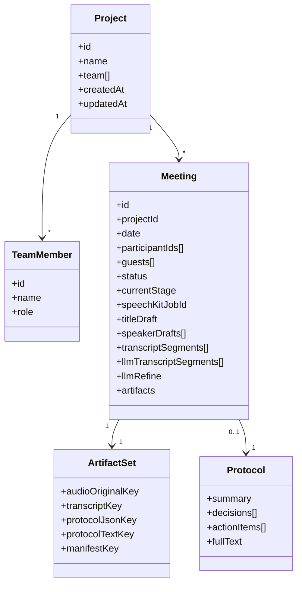

# Доменная модель

## Основные сущности

## Смысл сущностей

### `Project`

Контекст, внутри которого создаются встречи и хранится команда.

### `TeamMember`

Известный участник проекта, с которым система может сопоставлять имена из транскрипта.

### `Meeting`

Центральная сущность обработки. Содержит состояние, артефакты и draft-данные.

### `ArtifactSet`

Набор ключей до файлов и JSON-артефактов в хранилище.

### `Protocol`

Результат финальной AI-обработки.

## Главное правило модели

`meeting.json` является главным агрегатом состояния встречи для UI и backend orchestration.
