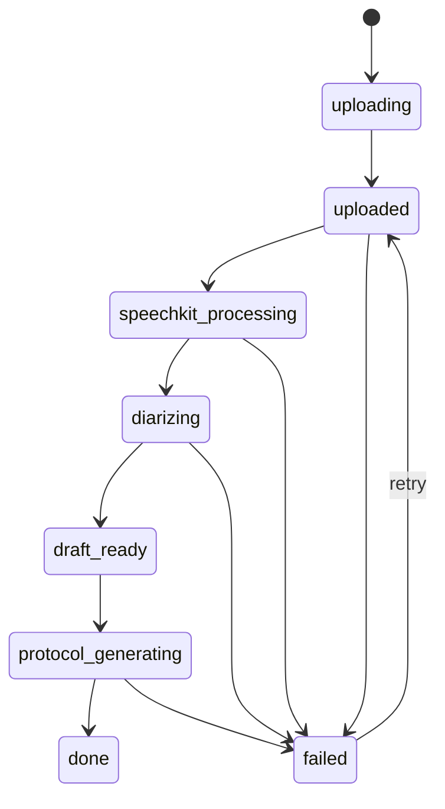
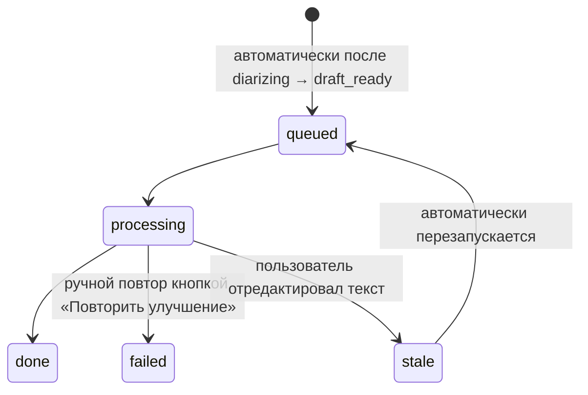
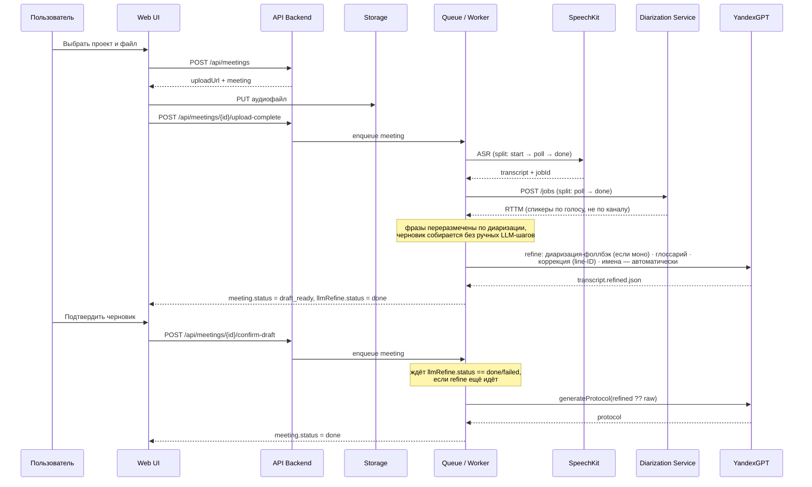

# Состояния и последовательности

## Жизненный цикл встречи

`diarizing` — асинхронный опрос сервиса диаризации
(`apps/diarization-service`, pyannote.audio, портировано из
research/diarization-asr-lab), тем же паттерном поллинга, что и ASR. Если
сервис не настроен, упал или превысил таймаут (90 минут) — не роняет
встречу, а откатывается на разметку спикеров из ASR (см. «Ошибочные ветки»).

Улучшение расшифровки ИИ идёт **ортогонально** основному статусу — отдельным
полем `llmRefine.status`, не меняя `meeting.status`. Запускается
автоматически, без ручной кнопки:

## Основная последовательность обработки

## Ошибочные ветки

- если транскрипт не получен (или распознавание пустое — `POOR_TRANSCRIPT`), встреча уходит в `failed`;
- если ASR висит дольше 40 минут — `SPEECHKIT_TIMEOUT` → `failed`;
- если диаризация не настроена, упала или висит дольше 90 минут — используется
  разметка спикеров из ASR как есть, встреча НЕ падает;
- если финальный протокол не собран, встреча уходит в `failed`;
- сбой refine помечает `llmRefine.status=failed`, но НЕ роняет статус встречи;
  `generateProtocol` дожидается `done`/`failed` перед сборкой протокола, но
  никогда не блокируется бесконечно — `failed` тоже разблокирует сборку
  (на raw/correctedText вместо refined-текста);
- сбой QA-шага (`qaProtocol`, D1/D2 — запускается только при `transcriptQuality` fair/poor)
  логируется как warning и НЕ роняет статус встречи: уже собранный `extractProtocol`
  возвращается без QA-аннотаций вместо потери всего протокола;
- повторная попытка (`retry`) возвращает встречу к обработке и запускает пайплайн заново.
