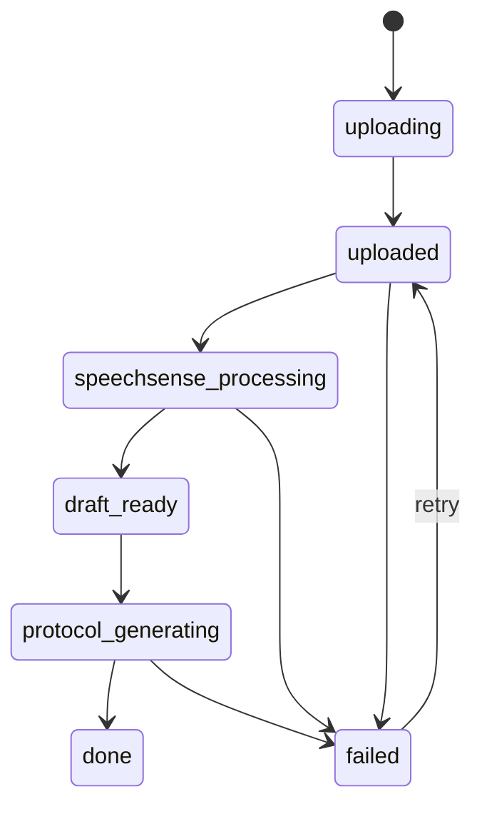
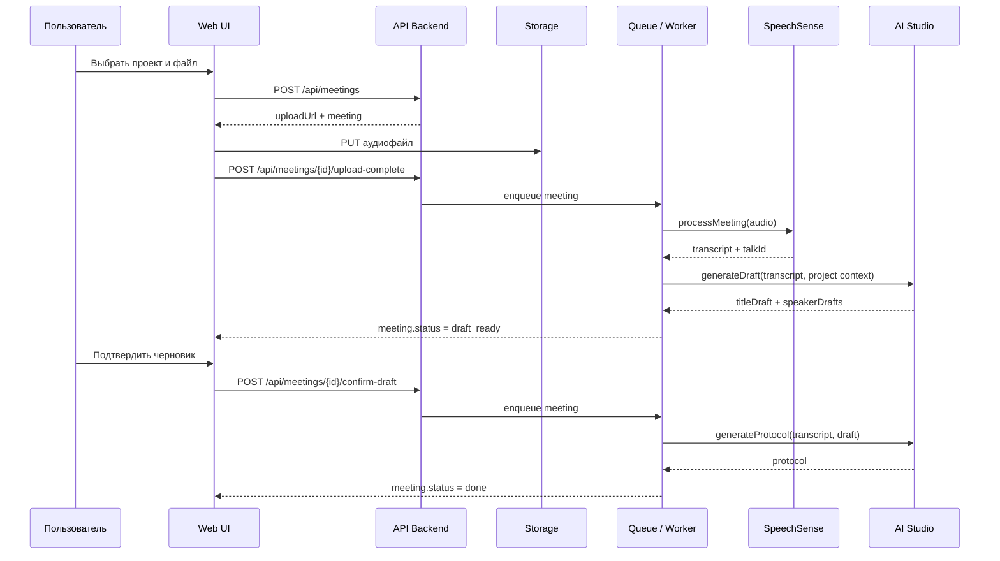

# Состояния и последовательности

## Жизненный цикл встречи

## Основная последовательность обработки

## Ошибочные ветки

- если транскрипт не получен, встреча уходит в `failed`;
- если финальный протокол не собран, встреча уходит в `failed`;
- повторная попытка возвращает встречу в `uploaded` и запускает пайплайн заново.
