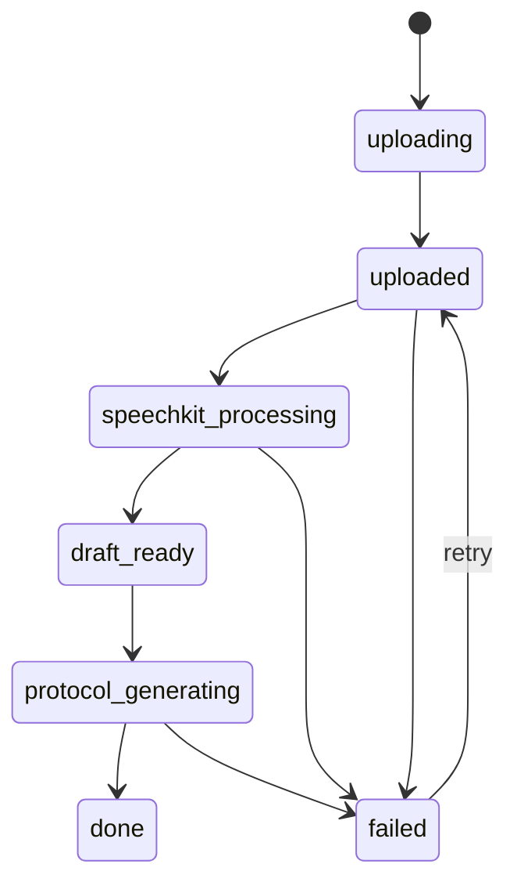
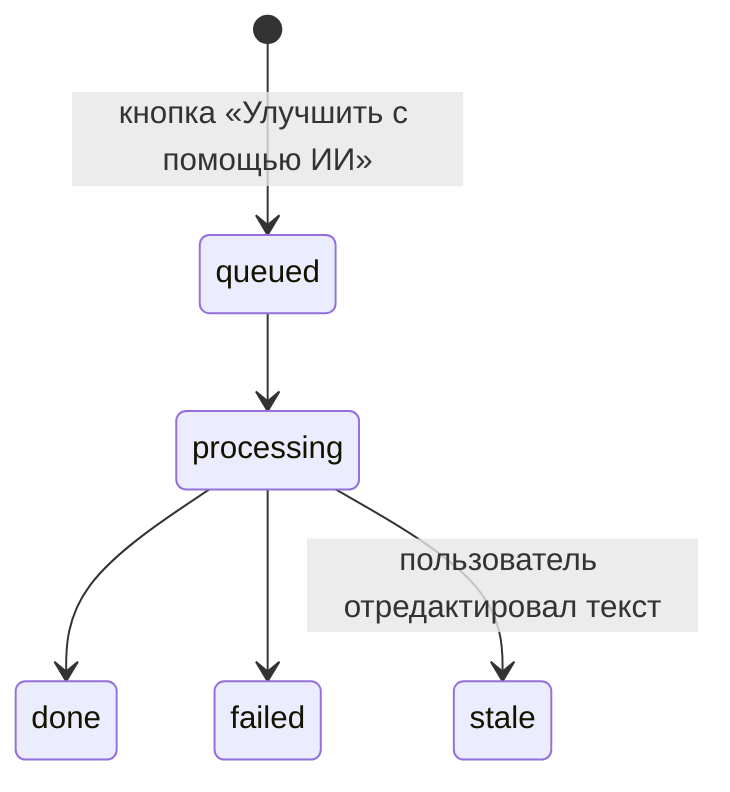
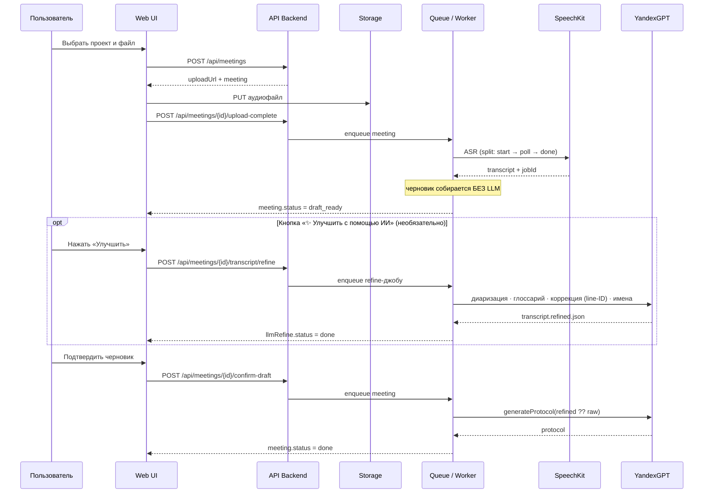

# Состояния и последовательности

## Жизненный цикл встречи

Улучшение расшифровки ИИ идёт **ортогонально** основному статусу — отдельным
полем `llmRefine.status`, не меняя `meeting.status`:

## Основная последовательность обработки

## Ошибочные ветки

- если транскрипт не получен (или распознавание пустое — `POOR_TRANSCRIPT`), встреча уходит в `failed`;
- если ASR висит дольше 40 минут — `SPEECHKIT_TIMEOUT` → `failed`;
- если финальный протокол не собран, встреча уходит в `failed`;
- сбой refine помечает `llmRefine.status=failed`, но НЕ роняет статус встречи;
- сбой QA-шага (`qaProtocol`, D1/D2 — запускается только при `transcriptQuality` fair/poor)
  логируется как warning и НЕ роняет статус встречи: уже собранный `extractProtocol`
  возвращается без QA-аннотаций вместо потери всего протокола;
- повторная попытка (`retry`) возвращает встречу к обработке и запускает пайплайн заново.
